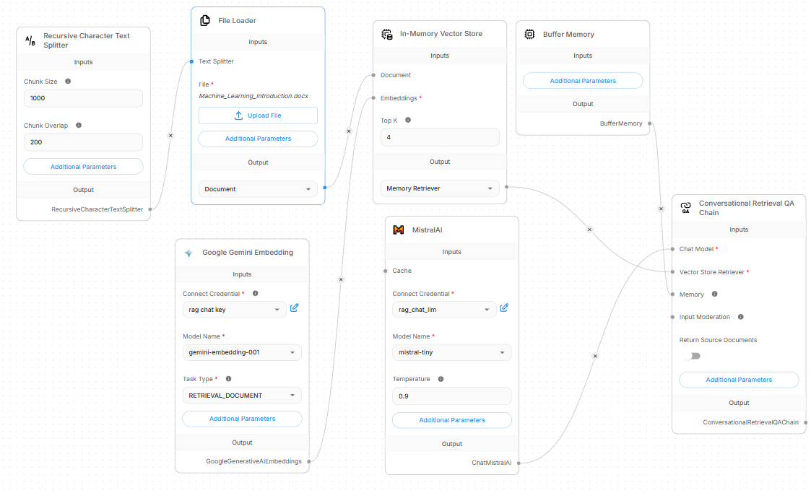

# Visual RAG Pipeline Prototype (Flowise)

A visual implementation of a Retrieval-Augmented Generation (RAG) chatbot using **Flowise**. This project serves as a rapid-prototyping companion to my code-based RAG application, allowing for quick experimentation with chunking strategies, embeddings, and vector orchestration.

## 📊 Pipeline Architecture

## 🛠️ How It Works

This low-code pipeline mirrors a traditional production RAG workflow across two main phases:

### 1. Ingestion & Vectorization (The Left Side)
* **Document Loading**: A local document (`Machine_Learning_introduction.docx`) is uploaded via the **File Loader**.
* **Text Chunking**: The **Recursive Character Text Splitter** breaks down the raw document into chunks of `1000` characters with a `200` character overlap to preserve local context.
* **Vector Embeddings**: Text chunks pass through **Google Gemini Embedding** (`gemini-embedding-001`), converting strings into mathematical vector representations.
* **Storage**: The vectors and raw text chunks are indexed together inside an **In-Memory Vector Store**.

### 2. Inference & Retrieval (The Right Side)
* **Orchestration**: The **Conversational Retrieval QA Chain** manages user queries.
* **Memory**: **Buffer Memory** preserves conversation history so the chatbot can handle follow-up questions contextually.
* **Semantic Search**: The chain queries the Vector Store to pull the top **4** (`Top K`) most contextually relevant chunks.
* **Generation**: The text chunks, query, and chat history are bundled and sent to the **MistralAI** node (`mistral-tiny` with a temperature of `0.9`) to generate a natural, grounded response.

---

## ⚖️ Low-Code vs. Traditional Coding RAG

I built this project to compare rapid UI-driven workflows against pure-code solutions. You can view my traditional code-based RAG implementation here: 
👉 **[Link to my Traditional Code RAG Repository](https://github.com)**

| Metric / Feature | Traditional Code RAG | Flowise Visual RAG |
| :--- | :--- | :--- |
| **Development Speed** | Hours/Days (Boilerplate & orchestration script) | Minutes (Drag-and-drop nodes) |
| **Granular Control** | Absolute (Token manipulation, custom wrappers) | Abstracted (Dependent on node parameters) |
| **Ideal For** | Production scaling, CI/CD, deep customization | Rapid prototyping, prompt testing, logic validation |

---

## 🚀 How to Run or Import This Flow

1. Install and run Flowise locally (`npx flowise start`) or deploy it to a service like Render.
2. Click **Add New** on your Flowise dashboard.
3. Click **Import Chatflow** in the top right corner and upload the configuration JSON file included in this repository.
4. Upload your own source documents to the **File Loader** node.
5. Configure your `Google Gemini` and `MistralAI` API credentials inside their respective nodes.
6. Click **Save** and start chatting!
